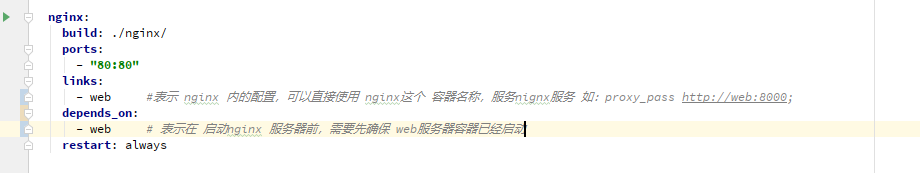
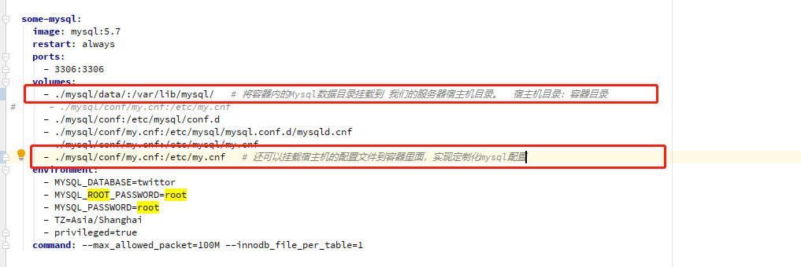
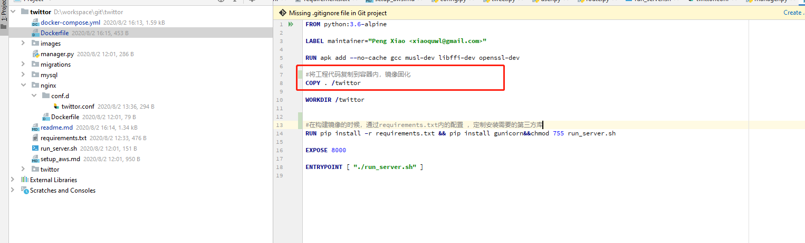
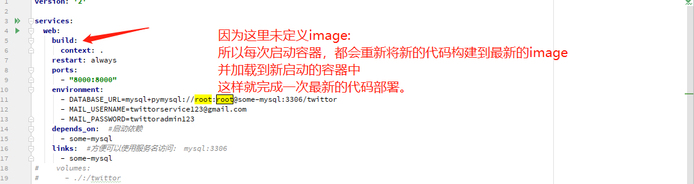
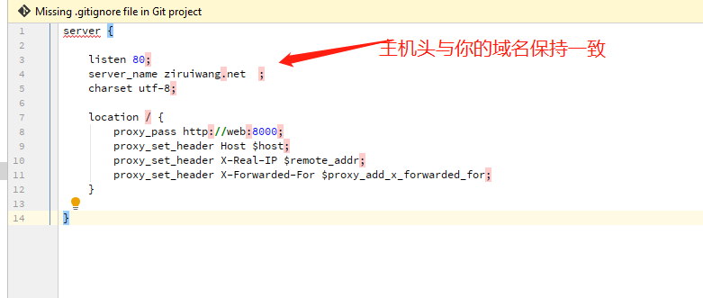

# Flask项目容器化维护

## 1 背景

容器化和做容器编排的，最大目的是固化配置，降低应用迁移成本。


## 2 docker 与 docker-compose安装

```bash
#docker安装
curl -fsSL get.docker.com -o get-docker.sh
sudo sh get-docker.sh --mirror Aliyun

#设置Docker服务开机自启
systemctl enable docker.service

#启动docker
service docker start
### 通过下面的命令来检查Docker的安装是否正确：
docker version 


#docker-compose安装
sudo curl -L https://github.com/docker/compose/releases/download/1.26.2/docker-compose-$(uname -s)-$(uname -m) -o /usr/local/bin/docker-compose
chmod +x /usr/local/bin/docker-compose
docker-compose --version
```


## 3 docker-compose配置- 容器编排关键点

### 3.1 容器依赖与关联配置




### 3.2 容器持久化配置

持久化目的是防止容器重启后数据丢失，比如数据库如果不做持久化，那么重启数据库容器数据将丢失，在生产环境这种问题是灾难性的。

所以可以通过 volumes 将容器内的数据挂载到宿主机上来，防止数据丢失。




### 3.3 代码部署与不可变基础设施

为了最大程度将防止代码在生产环境被意外或随意修改，我们可以将代码固化到镜像。除非重新构建镜像，代码将保持稳定。






## 4 服务器上部署与启动工程

 

### 4.1 登陆服务器

```bash
sudo su - root
cd /home/ubuntu/twittor
```


### 4.2 部署与启动工程
```bash
git pull
docker-compose up --remove-orphans -d
```


## 5 其他


### 5.1 如果无法启动服务
```bash
sudo systemctl daemon-reload
systemctl restart  docker

netstat -lanp | grep 3306 | awk '{print $7}' | awk -F '/' '{print $1}' | xargs kill -9
netstat -lanp | grep 8000 | awk '{print $7}' | awk -F '/' '{print $1}' | xargs kill -9
netstat -lanp | grep 80 | awk '{print $7}' | awk -F '/' '{print $1}' | xargs kill -9
```

### 5.2 nginx 配置注意事项



### 5.3 云服务器注意的配置

如果是新购入的服务器，在新建好服务器后，需要将nginx 80(http) 和 443(https)，加入安全组白名单，防止网站无法正常访问


